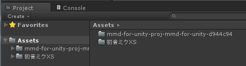
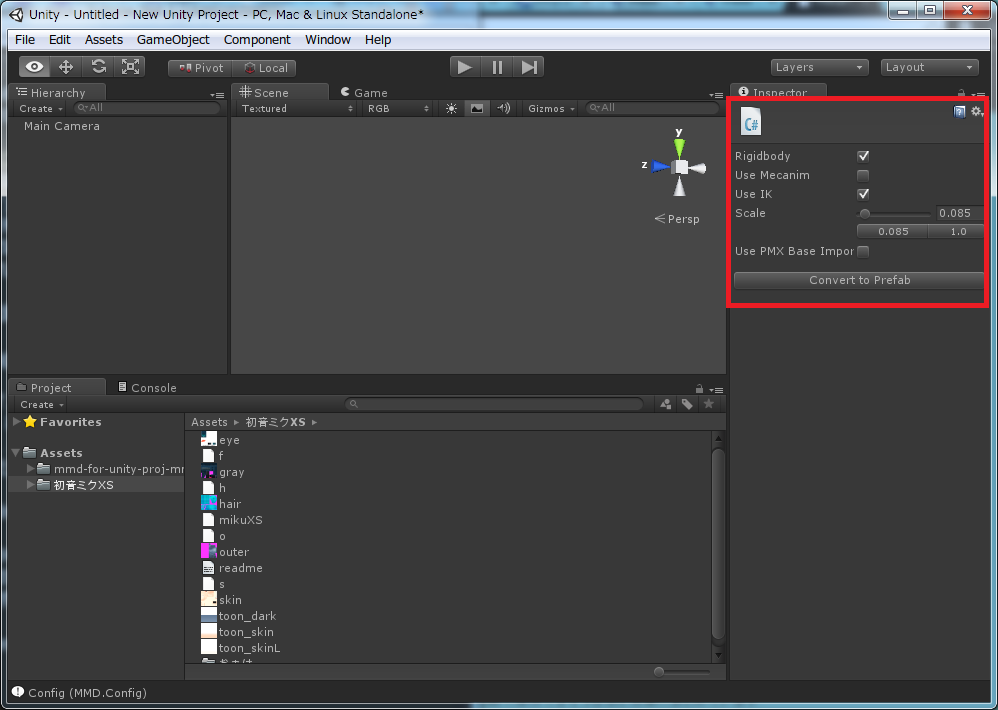
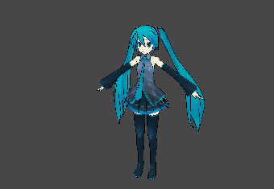

モデルデータの読み込み（導入）
========================

このチュートリアルではPMD Loaderを利用してPMDファイルをプレハブに変換する方法について解説します．主にUnityの操作の慣れていない人を対象に解説します．

このチュートリアルの前提として，MMD for Unityをインストールしてください．

# PMDファイルをプロジェクトへ追加する
MMD for Unityでは，MikuMikuDanceのモデルデータとして，PMDファイルとPMXファイルの読み込みに対応しています．PMDファイルとはMikuMikuDanceで利用できる標準的なモデルデータです．他にもPMDファイルの機能を拡張したPMXファイルもありますが，今回はPMDファイルでの読み込み方法を主眼に解説します．

まず，PMDファイルを用意します．PMDファイルは主に，[ニコニコ動画](http://www.nicovideo.jp/tag/MMD%E3%83%A2%E3%83%87%E3%83%AB%E9%85%8D%E5%B8%83%E3%81%82%E3%82%8A?ref=tagconcerned)もしくは[Bowlroll](http://bowlroll.net/)で探すことができます．PMDファイルは基本的に圧縮して配布されているため，[アーカイバ](https://www.google.co.jp/search?q=%E3%82%A2%E3%83%BC%E3%82%AB%E3%82%A4%E3%83%90)を利用して解凍してください．解凍するとフォルダが作成されます．そのフォルダの中にPMDファイルが入っています．

次に，PMDファイルをプロジェクトに追加します．Unityを起動した状態にしてください．

デフォルトでは画面下半分にProjectというタブがあります．Projectとは，Unityでゲームを作るために必要な素材を管理するためのタブです．左側でフォルダを管理し，右側でファイルを管理します．タブの左側へ先ほど解凍したフォルダをAsettsフォルダへドラッグ＆ドロップします．自動的にUnityがフォルダをインポートしてくれます．インポートが完了すると左側のフォルダ一覧に，インポートしたフォルダ名が表示されます．

インポートしたフォルダをクリックすると，右側にそのフォルダの中身が表示されます．PMDファイルのほかに，readmeやテクスチャなどがフォルダに入っていることがわかります．このフォルダの中からPMDファイルをクリックしてください．PMDファイルをクリックすると，InspectorにPMDファイルを変換するための設定が表示されます．

今回はPMDファイルを変換します．特に設定を変更することはありませんので，そのままConvert to Prefabボタンをクリックしてください．変換が完了すると変換したモデルが表示されます．（PMXファイルを変換するときは，事前に別途Use PMX Base Importをチェックしてください）

