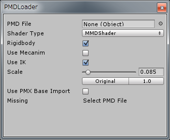
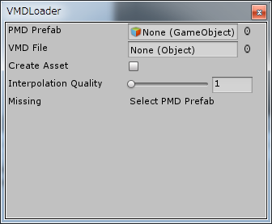

MMD for Unityの使い方
========================

## MikuMikuDanceの基礎
MikuMikuDanceとは，樋口優氏が開発した3DCGアニメーションソフトの1種です．
3DCGの初音ミクが踊っている動画を作成するために作られたフリーソフトです．

MikuMikuDanceではニコニコ動画やYoutubeを中心に，多くの動画が公開されています．
また，有志によって多くのモデルデータやモーションデータが公開されているため，
初音ミクの他に色々なキャラクターが踊る動画を作ることができます．

### データの基本
MikuMikuDanceでは，3種類のデータを扱うことができます．
シーンデータを扱うための **PMMファイル** ，
モデルデータを扱うための **PMD/PMXファイル** ，
モーションデータを扱うための **VMDファイル** の3種類です．

MikuMikuDanceでは，キャラクターを3DCGのデータとして扱っています．
そのデータが **PMD/PMX** ファイルです．
また，キャラクターを踊らせた時のデータ（モーション）が **VMDファイル** です．

MikuMikuDanceではモデルデータ（キャラクター）をいくつか読み込み，
それぞれ踊りや振り付けなどを編集します．
この時，編集している場面を **シーン** と呼びます．
このシーンを保存するためのデータが **PMMファイル** です．

VMDファイルとPMMファイルの違いは，
PMMファイルはMikuMikuDanceで編集している場面全体を保存するためのデータなのに対し，
VMDファイルはキャラクター1体だけのモーションを保存するためのデータとなっていることです．
このことから，場面全体を保存したい場合はPMM，モーションを公開したい場合はVMDになっています．

### モーションを保存する
MikuMikuDanceのキャラクターでゲームを作るのに，
ダウンロードしたモーションだけでは足りないこともあります．
その時はMikuMikuDanceでモーションを自作し，
モーションデータをMMD for Unityで読み込みます．

自作したモーションは，
保存したいキーフレームを選択してから「ファイル-モーションデータを保存」で保存することができます．
キーフレームが選択されていないと正しく保存されないので注意して下さい．
キーフレームを選択する方法はいくつかありますが，
その中でも一般的な方法を紹介します．

まず，フレーム操作下部のプルダウンメニューから，「全フレーム」を選択して下さい．
次に，隣のテキストボックスに保存したいフレーム数の範囲を入力し，
範囲選択ボタンをクリックします．
これで指定範囲のキーフレームが選択状態になります．

他にも，プルダウンメニューから「選択ボーン」を選ぶことで，
選択したボーンだけを保存することのできる機能もあります．

## MMD for Unityのインストール
MMD for UnityのフォルダをUnityのProjectに置くだけです．

## MMD for Unityの使い方
MMD for Unityでは，PMD/PMXファイルの読み込みと，VMDファイルの読み込みができます．
それぞれの操作方法について説明します．

### PMD Loader
PMD Loaderとは，PMDファイルを読み込むための機能です．
MikuMikuDanceのモデルデータをUnityにインポートします．
PMD LoaderはメニューバーのMMD for Unity（旧バージョンではPlugins），
もしくはPMDファイルをクリックし，Inspectorを操作することで利用できます．

まず，PMD Loaderを起動する前にモデルデータをProjectに追加する必要があります．
モデルデータが入っているフォルダごと，Projectへドラッグ＆ドロップしてください．
なお，このフォルダの中身を変更したり移動すると読み込みに失敗します．

PMD Fileには，MikuMikuDanceのPMDファイルをドラッグ＆ドロップしてください．
PMDファイルをドラッグ＆ドロップすると，Convertボタンが現れるのでクリックすると読み込みが始まります．
読み込みが完了するとProjectにPrefabが追加されます．
また，読み込んだキャラクターがHierarchyに追加されるので，成功の目安にしてください．

それぞれの項目の意味について説明します．

Shader Typeは描画するのに使われるシェーダの種類を選択します．デフォルトはMMDShaderです．
Rigidbodyは剛体を利用したいときにチェックします．
Use Mecanimをチェックすると，Mecanimが利用できるように調整します．
Use IKは，IKを利用したいときにチェックします．
Scaleは読み込んだモデルの大きさです．
UnityとMikuMikuDanceでは，大きさの単位が異なるため，
MikuMikuDanceからUnityへ大きさを揃える必要があります．
Originalボタンを押すと，1メートルを基準とした大きさに揃えられます．
1.0ボタンを押すと，MikuMikuDanceを基準とした大きさに揃えられます．
Use PMX Base Importは，PMXファイルを読み込みたいときにチェックします．

### VMD Loader
VMD Loaderとは，VMDファイルを読み込むための機能です．
MikuMikuDanceのモーションデータをUnityにインポートします．
VMD LoaderはメニューバーのMMD for Unity（旧バージョンではPlugins），
もしくはVMDファイルをクリックし，Inspectorを操作することで利用できます．

